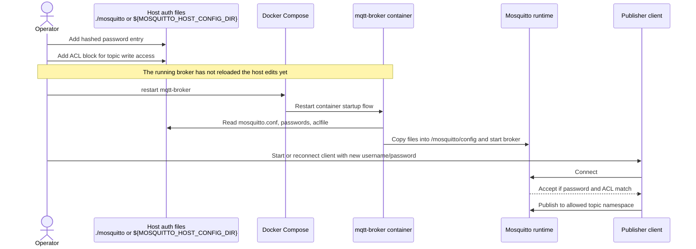

# Secure Broker How-To

This is the standalone broker-only copy of the secure Mosquitto operational guide.

It focuses on the broker runtime, password file management, ACL management, and the safe restart flow for a read-only mounted config source.

## Current Layout

The fork is driven by these files:

- `docker-compose.yml`
- `mosquitto/mosquitto.conf`
- `mosquitto/passwords`
- `mosquitto/aclfile`

The host-mounted config source directory is:

- default: `./mosquitto`
- override: `${MOSQUITTO_HOST_CONFIG_DIR}`

## Source Of Truth

The broker reads from the host-mounted config source directory and copies those files into `/mosquitto/config` at startup.

Important behavior:

- the host config directory is the only persistent source of truth
- the mount is read-only
- the broker container copies `mosquitto.conf`, `passwords`, and `aclfile` from `/mosquitto/config-src` into `/mosquitto/config`
- edits to host-side auth files do not affect the running broker until the broker is restarted
- edits made only inside the running container do not persist

## Read-Only Mount Rule

The config source mount is intentionally `:ro`.

That means:

- add or change usernames on the host
- add or change password hashes on the host
- add or change ACL rules on the host
- restart the broker after those host-side edits

Do not use the running container as the place where you maintain broker users.

Avoid workflows like:

- editing `/mosquitto/config/passwords` inside the running container
- editing `/mosquitto/config/aclfile` inside the running container
- assuming `docker compose build` alone reloads password or ACL changes

## Files

- `mosquitto/mosquitto.conf`
- `mosquitto/passwords`
- `mosquitto/aclfile`
- `docker-compose.yml`

## Quick Rules

- every publisher should get its own MQTT username and password
- every publisher should get a write-only ACL for its own topic namespace
- every subscriber should get its own MQTT username and password unless you intentionally choose a shared subscriber account
- subscribers should receive only the read ACLs they actually need
- adding one publisher usually means updating two broker files:
  - `mosquitto/passwords`
  - `mosquitto/aclfile`

## Safe Username/Password Workflow

Use this sequence whenever you add a new MQTT account.

1. Edit `mosquitto/passwords` on the host
2. Edit `mosquitto/aclfile` on the host
3. Restart `mqtt-broker`
4. Restart or reconnect any client that should use the new credentials

## Sequence Diagram: Add One Publisher

This diagram shows the safe flow for adding one new publisher account in the current read-only mount design.



## Safe Restart Pattern

After editing host-side broker auth files, use:

```bash
docker compose restart mqtt-broker
```

If you are operating a publisher or subscriber outside this fork, restart or reconnect that client after the broker restart if its credentials or access scope changed.

## Script Order

When you use the local helper scripts, the safe order is:

Before step 1:

- make sure you are editing the repo-local source-of-truth files, not the live container files
- if you are changing an existing working device, note the current username, topic block, and plain-text password before you replace them

1. Set or update the password entry in `mosquitto/passwords`.

```bash
./scripts/mosquitto-hash-password.sh washer-plug 'A3D6173E9C3178F18C01858EBF866CF6' ./mosquitto/passwords
```

2. Set or update the ACL block in `mosquitto/aclfile`.

```bash
./scripts/mosquitto-acl-user.sh set washer-plug "topic write shellies/washing-plug/#" "topic read shellies/washing-plug/relay/0/command"
```

Below step 2:

- if the password and ACL changes look correct, it is a good time to commit them before deployment
- committing here gives you a clean rollback point if step 4 or step 5 fails

Example:

```bash
git add mosquitto/passwords mosquitto/aclfile
git commit -m "Update MQTT credentials and ACL for washer-plug"
```

3. Sync the broker stack to the Raspberry Pi host.

```bash
./scripts/rsync-mosquitto-to-pi.sh --host 192.168.178.58 --user fraank
```

4. Restart `mqtt-broker` on the Raspberry Pi host.

```bash
ssh fraank@192.168.178.58 'cd /mnt/nvme/mqtt && docker compose restart mqtt-broker'
```

5. Reconnect the device or test client with the plain-text password you chose.

```bash
mosquitto_sub -h 192.168.178.58 -p 1883 -u washer-plug -P 'A3D6173E9C3178F18C01858EBF866CF6' -t '#' -v
```

Important:

- `mosquitto-hash-password.sh` takes a human-readable password and writes the broker hash line
- `mosquitto-acl-user.sh` manages the topic block for one username
- `rsync-mosquitto-to-pi.sh` copies the host-side source-of-truth files to the Raspberry Pi
- the MQTT client or Shelly device must use the plain-text password, not the hash stored in `mosquitto/passwords`

## What Not To Do

- do not add users only inside the container
- do not edit only temporary files inside `/mosquitto/config` and expect them to survive restart or recreate
- do not assume a running broker will notice host-side auth file edits without a restart
- do not restart only clients after changing broker passwords or ACLs and expect the broker to have the new rules loaded

## Add Publishers On Initial Startup

Use this path when the broker is not running yet, or when you are preparing the next clean startup.

### 1. Add the publisher credentials

Append a new line in `mosquitto/passwords`.

Follow the existing format:

```text
publisher-node-4:<hashed-password>
```

Do not store plain-text passwords in this file. It must contain Mosquitto password hashes like the existing entries.

To generate a hash line from a human-readable password with the local helper:

```bash
./scripts/mosquitto-hash-password.sh publisher-node-4 publisher-node-4-secret
```

To update or append that user directly in `mosquitto/passwords`:

```bash
./scripts/mosquitto-hash-password.sh publisher-node-4 publisher-node-4-secret ./mosquitto/passwords
```

To hash one password with the Mosquitto container tooling, use:

```bash
docker run --rm eclipse-mosquitto:2 \
  sh -c 'mosquitto_passwd -b /tmp/passwords publisher-node-4 publisher-node-4-secret && cat /tmp/passwords'
```

This prints one `username:hash` line that you can copy into `mosquitto/passwords`.

### 2. Add the publisher ACL

Append a new block in `mosquitto/aclfile`.

Example:

```text
user publisher-node-4
topic write sensors/node-4/#
```

This lets that account publish only under `sensors/node-4/...`.

To manage one user's ACL block with the local helper:

```bash
./scripts/mosquitto-acl-user.sh get publisher-node-4
./scripts/mosquitto-acl-user.sh set publisher-node-4 "topic write sensors/node-4/#"
./scripts/mosquitto-acl-user.sh remove publisher-node-4
```

### 3. Start the broker

```bash
docker compose up -d
```

## Add Publishers While The Broker Is Running

This is the safe operational path for the current fork setup.

### What must be restarted

- restart `mqtt-broker` after changing `mosquitto/passwords`
- restart `mqtt-broker` after changing `mosquitto/aclfile`
- restart `mqtt-broker` after changing `mosquitto/mosquitto.conf`

The running broker does not automatically consume edits from the host-side config source because those files are copied into the live config directory only during broker startup.

### Recommended sequence

1. Edit `mosquitto/passwords`
2. Edit `mosquitto/aclfile`
3. Restart `mqtt-broker`
4. Restart or reconnect the affected client

Example:

```bash
docker compose restart mqtt-broker
```

## Add Multiple Publishers At Once

The cleanest pattern is one publisher account per device or logical simulator.

For five new device simulators:

1. add five hashed entries in `mosquitto/passwords`
2. add five ACL blocks in `mosquitto/aclfile`
3. restart `mqtt-broker`
4. reconnect or restart those five clients

Keep each publisher aligned like this:

- MQTT username: `publisher-node-7`
- ACL topic root: `sensors/node-7/#`

That convention makes ACL review and troubleshooting much easier.

## Add A New Metric For An Existing Publisher

Example: add `sensors/node-1/pressure`.

### Needed changes

- no password file change is required if the existing publisher account stays the same
- no ACL change is required if `topic write sensors/node-1/#` already covers the new metric

### Needed only when the ACL is narrower

If you are using a narrower ACL than `sensors/node-1/#`, extend the ACL block in `mosquitto/aclfile` and restart the broker.

## Add A New Subscriber

Use the same pattern as publishers, but define read ACLs instead of write ACLs.

Example restricted subscriber:

```text
user subscriber-temp-only
topic read sensors/+/temp
```

Example broad overview/admin-style subscriber:

```text
user subscriber-admin
topic read #
topic read $SYS/#
```

Be conservative with broad read access.

## Optional External Host Path

To use `/mnt/nvme/mqtt/mosquitto` instead of the repo-local `./mosquitto` directory:

```bash
MOSQUITTO_HOST_CONFIG_DIR=/mnt/nvme/mqtt/mosquitto docker compose up -d
```

## Use A Technitium DNS Name

If you want devices to connect to the broker as `mqtt.<zone>` instead of a raw IP address:

1. run this stack on the Raspberry Pi host that will accept MQTT on port `1883`
2. set these compose variables on that host:

```bash
MQTT_HOSTNAME=mqtt
MQTT_ZONE=example.lan
```

3. create a Technitium DNS `A` record:

```text
mqtt.example.lan -> <raspberry-pi-host-ip>
```

Important:

- Technitium must point `mqtt.<zone>` to the Raspberry Pi host IP, not the container IP
- the published port remains `1883`, so devices should use `mqtt.<zone>:1883`
- `hostname` and `domainname` in Compose do not create external DNS records by themselves
- this repo does not manage Technitium; the DNS record must be created in your DNS server separately

## Sync Host Files To A Raspberry Pi

If the broker runs on a Raspberry Pi, you can sync this repo's broker stack to the Pi with:

```bash
./scripts/rsync-mosquitto-to-pi.sh --host raspberrypi.local --dry-run
./scripts/rsync-mosquitto-to-pi.sh --host raspberrypi.local
```

This pushes:

- `docker-compose.yml` to the remote stack directory
- `mosquitto/` to the remote stack directory as `mosquitto/`

Defaults:

- remote user: `pi`
- remote directory: `/mnt/nvme/mqtt`

Override them if needed:

```bash
./scripts/rsync-mosquitto-to-pi.sh --host 192.168.1.44 --user mqttadmin --remote-dir /srv/mosquitto
```

This layout matches the default compose mount:

- remote compose file: `/mnt/nvme/mqtt/docker-compose.yml`
- remote config directory: `/mnt/nvme/mqtt/mosquitto`

After syncing updated compose or broker files, restart the broker on the Raspberry Pi so the running container reloads them.

## Validation Checklist

After adding or changing broker users, verify:

- `docker compose logs -f mqtt-broker`
- the expected client can connect with the new username/password
- the client can only publish or subscribe to the topic scope allowed by its ACL

## Listen To All Topics

This repo already includes a read-only subscriber example in `mosquitto/aclfile`:

```text
user subscriber-topics
topic read #
topic read $SYS/#
```

Use that account to watch all broker traffic from a console:

```bash
mosquitto_sub -h 127.0.0.1 -p 1883 -u subscriber-topics -P '<subscriber-password>' -t '#' -v
```

If you want broker status topics too, subscribe to both topic spaces:

```bash
mosquitto_sub -h 127.0.0.1 -p 1883 -u subscriber-topics -P '<subscriber-password>' -t '#' -t '$SYS/#' -v
```

From another machine on the LAN, replace `127.0.0.1` with the Raspberry Pi host name or IP, for example `pi5.home.arpa`.

## Common Mistakes

- adding a password entry but forgetting the ACL block
- editing host-side files and forgetting to restart the broker
- testing only client reconnect behavior without reloading the broker config
- storing plain-text passwords in `mosquitto/passwords`
